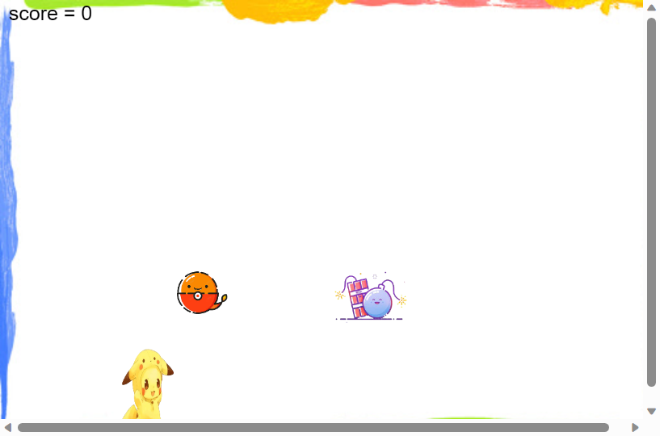

  This project is a simple pick up game. In the game, players need to catch falling items by swaping the screen or dragging items. They fall at different speeds, and players need quick reflexes and precise operations to catch them. It will keep track of the player's high score, and it will be updated when the player exceeds the previous high score.

My role and work:
 
  I'm the game designer and developer for this project. I'm responsible for creating the overall concept of the game, including gameplay, design of items, and difficulty settings. Wrote the core code of the game, including item spawning and movement, response to player input, scoring system, etc. And make sure the game works well on both mobile and computer.
  
What did you learn from the experience?
 
  I learned important lessons and skills about game design and development. I learned how to create interesting and engaging gameplay, and how to keep players interested by adjusting the difficulty and challenge.

Source: <a href="https://github.com/BYL-RHS/byl-rhs.github.io"><i class="large github icon "></i>byl-rhs.github.io</a>
